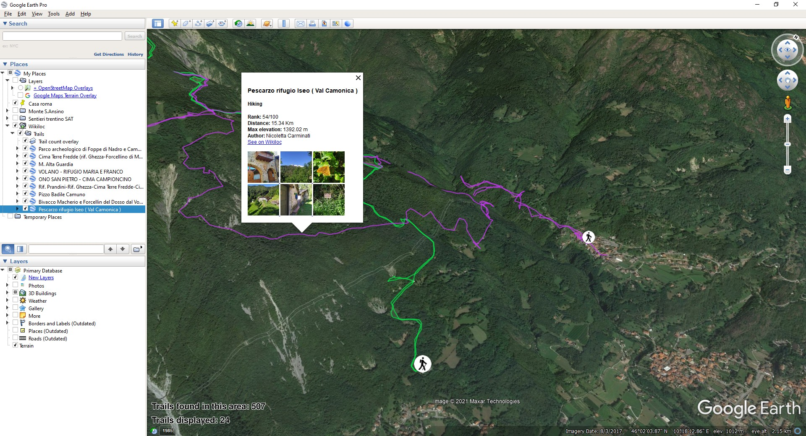

# Wikiloc Google Earth layer

  

  

  

  

  

 

  

 

<b>View Wikiloc.com trails in Google Earth.</b>

Tiny http server written in Go that fetch trails from wikiloc.com to compose KML updates in the Google Earth view area.

 

  

  

  

  

## Usage

### Use remotely
- Download [this KMZ file](http://wikiloc-earth-layer.jonamat.cloud/static/wikiloc-earth-layer.kmz) 
- Open Google Earth Pro, go to file > open and select the downloadedwikiloc-earth-layer.kmz
- Navigate to the area you want to explore
- Refresh the layer by right clicking on the layer > refresh
- Enjoy your adventures!

**This service is demonstrative. See "[Slow or unresponsive service using remote KMZ](#slow-or-unresponsive-service-using-remote-kmz)" section if you experience lag or connection problems**

### Use locally
- Download & extract the last release from [this page](https://github.com/jonamat/wikiloc-earth-layer/releases) according to the target platform.
- Run the binary `./bin/wikiloc-earth-layer` (or .exe in windows)
- Open Google Earth, go to file > open and select from the extracted folder ./web/static/wikiloc-earth-layer.kmz
- Navigate to the area you want to explore
- Refresh the layer by right clicking on the layer > refresh
- Enjoy your adventures!

If you want to compile the binary yourself, follow [these](#build-with-go) instructions  

### Use from the app (Android)
- Download [this KML file](http://wikiloc-earth-layer.jonamat.cloud/static/wikiloc-earth-layer.kmz) 
- Open it directly or import in Google Earth: go to settings > projects > open and select the downloaded wikiloc-earth-layer.kmz
- Navigate to the area you want to explore
- Refresh the layer by tapping on settings > project > layer > refresh
- Enjoy your adventures!

## Known issues

### Refresh system is inconvenient to use
I know, but it's necessary. Uploading the trails on camera movement has an even worse user experience. Unfortunately Google Earth doesn't support interactive applications as much. But maybe I found a workaround, I'm working on it. Encourage me supporting this project!

### Slow or unresponsive service using remote KMZ
The service is currently hosted in an unscaled machine that has the computing power of a coffee maker. Each request to the server must handle up to 25 calls to wikiloc, involving geometric calculations and encoding/decoding operations for each of them, so it's easy that the server blown down with multiple users connected. Furthermore, an excessive amount of requests to the Wikiloc servers could trigger their rate limiters.
If you want a decent lag and zero problems, follow the [Use locally](#use-locally) instructions to host the service yourself.

### Elevation and distance are displayed in metric units only
If you want to use imperial units, use the env var UNITS=imperial and restart the server

### Only 24 trails are shown, although there are many more in the area
This is a (reasonable) Wikiloc limitation. You can encounter the same problem from navigating the official wikiloc maps. Zoom in the area you want to explore and refresh the layer to show more specific trails for that area.

### When camera is tilted, the resulting trails are far from the view area
Yep. When camera is tilted, the area you are exploring is the Lat-Lon point from the top right to the bottom left corner of the screen. Straighten your view to get a more precise result.

## Tips and tricks
I recommend using the layer in combination with  
- [Google Maps Terrain layer](https://ge-map-overlays.appspot.com/google-maps/terrain) to show the contour lines of the terrain 
- [Open Street Map layer](https://ge-map-overlays.appspot.com/openstreetmap) to show a detailed map of the terrain types, peak names and more

## Development and contribution
The project is a suite of 3 software
- **get-icons** to fetch the svg icon set from wikiloc.com and convert them to png
- **gen-kml** to generate the init KML file which contains the network link for Google Earth
- **wikiloc-earth-layer** is the http server that handle the updates from the network link

In the Makefile are defined the commands to run and build the source.  
The project is set up to follow the guidelines of the Golang team that you can find [here](https://github.com/golang-standards/project-layout).

### Build with Go
- Install [Go](https://golang.org)
- Clone this repo
- Go to the directory of the project with your terminal and type `make build` OR type:  
   `go build -v -x -o ./bin/wikiloc-earth-layer ./cmd/server/wikiloc-earth-layer.go`
- Wait for the build to finish
- Now you can find the compiled binaries in `./bin/`

### Build with Docker
- Install [Docker](https://www.docker.com/)
- Clone this repo
- Go to the directory of the project with your terminal and type `make build-with-docker` OR type:  
  `docker run --mount type=bind,source="$(pwd)"/target,target=/app golang:1.17.0-bullseye make build & make gen-kml & make get-icons & wait`
- Wait for the build to finish
- Now you can find the compiled binaries in `./bin/`

### Working with dev containers
This repository provide all the tools to start writing and testing your code without any configuration.  
To use devcontainer feature you need to have Docker installed and the Remote Containers extension enabled in VSCode.  
See [Developing inside a Container](https://code.visualstudio.com/docs/remote/containers) for details.  

## Licence
GNU GPLv3
